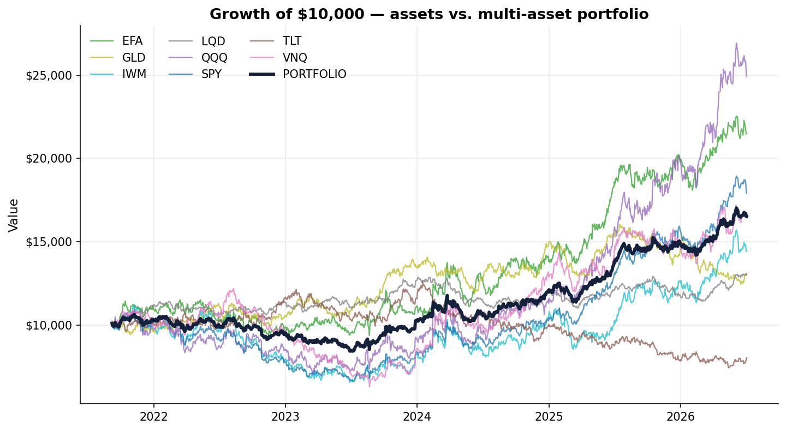
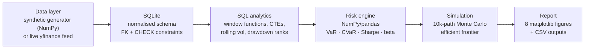
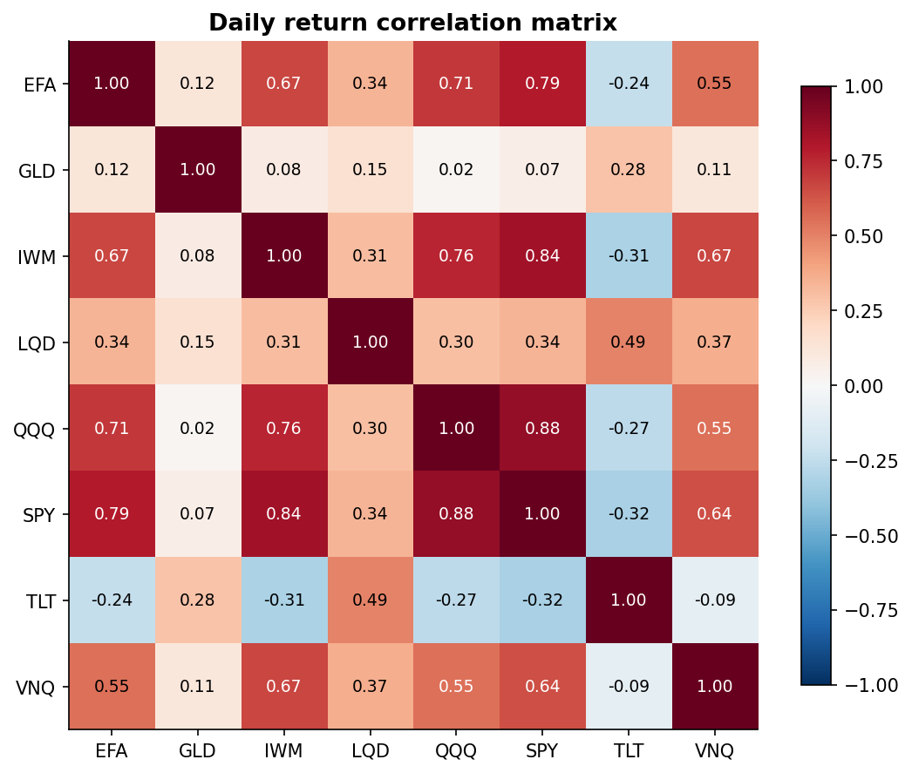
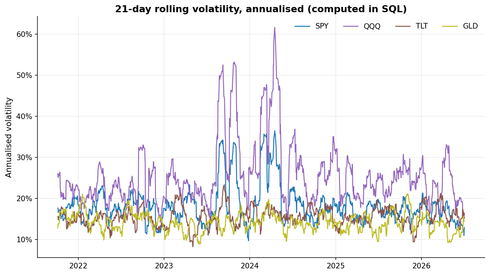
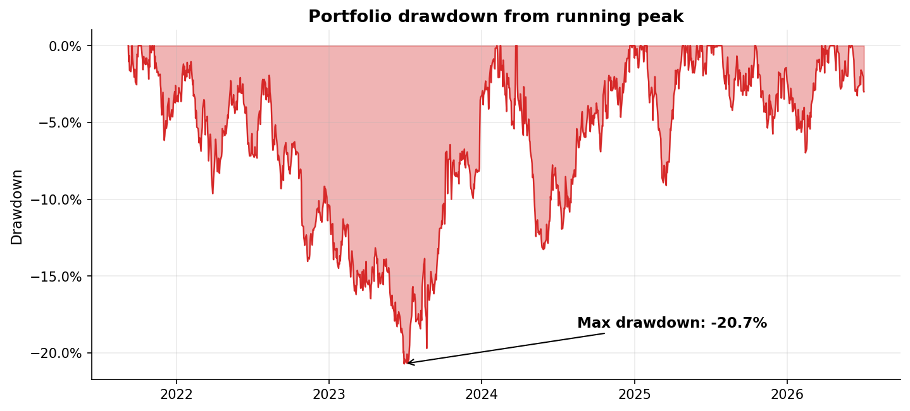
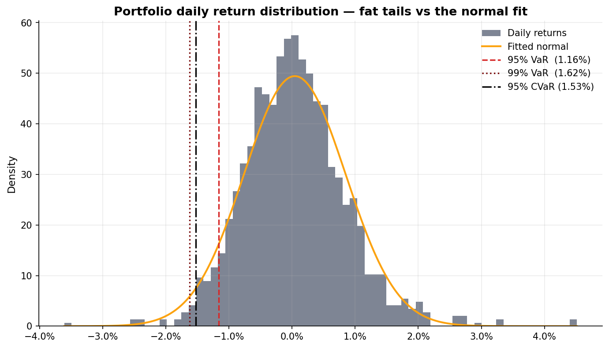
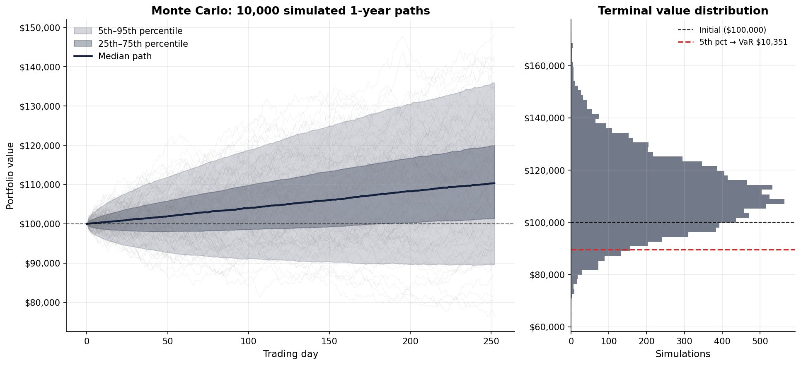
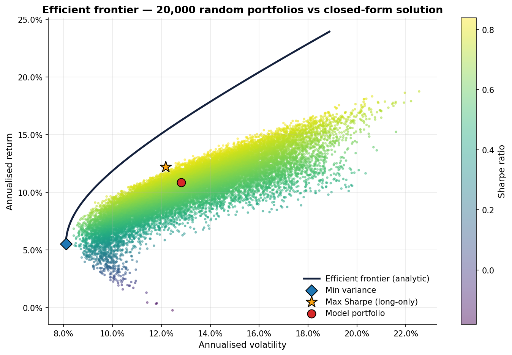
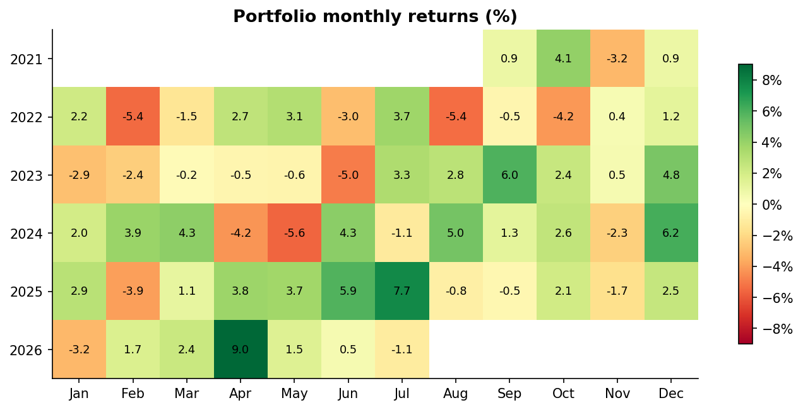

# Portfolio Risk Analytics


**Built to answer one question: how much could this portfolio lose, and how confident can we be in that number?**

An end-to-end risk analytics pipeline for a multi-asset ETF portfolio, built with **SQL (SQLite)** and **Python (NumPy / pandas / matplotlib)** — no black-box libraries. Market data flows into a relational database, gets shaped by analytical SQL (window functions, CTEs), and is then priced for risk by a vectorised Python engine: VaR/CVaR three ways, Monte Carlo simulation, and a closed-form Markowitz efficient frontier.



## Pipeline



The pipeline is data-source agnostic: it ships with a reproducible synthetic dataset (so it runs anywhere, instantly) and switches to **live market data** with one flag:

```bash
python run_analysis.py            # bundled demo dataset (seeded, reproducible)
python run_analysis.py --live     # real 5y adjusted closes via yfinance
```

## Skills demonstrated

| Area | Where | What |
|---|---|---|
| **SQL** | [`sql/`](sql/) | Window functions (`LAG`, running `MAX`, explicit `ROWS BETWEEN` frames), CTE pipelines, `RANK`/`ROW_NUMBER`, `FIRST_VALUE`/`LAST_VALUE`, multi-table joins, schema design with FK + CHECK constraints |
| **Python / NumPy** | [`src/portfolio_risk/`](src/portfolio_risk/) | Vectorised simulation (Cholesky-correlated returns, regime-switching Markov chain), closed-form matrix optimisation, dataclasses, type hints |
| **pandas** | [`metrics.py`](src/portfolio_risk/metrics.py) | Time-series transforms, rolling statistics, pivot/long-format reshaping, groupwise analytics |
| **Statistics** | [`metrics.py`](src/portfolio_risk/metrics.py), [`monte_carlo.py`](src/portfolio_risk/monte_carlo.py) | Historical vs parametric vs simulated VaR, expected shortfall, Sharpe/Sortino/Calmar, CAPM beta, drawdown analysis |
| **Testing** | [`tests/`](tests/) | 29 pytest cases; every SQL query is cross-validated against an independent pandas implementation |
| **Engineering** | [`.github/workflows/ci.yml`](.github/workflows/ci.yml) | CI on Python 3.10/3.12, packaging via `pyproject.toml`, one-command reproducibility |

## Key results (demo dataset, 5 years daily)

| Metric | Portfolio |
|---|---|
| Annualised return | **10.6%** |
| Annualised volatility | **12.8%** (vs 18.7% weighted-average of holdings — diversification saves ~6 pts) |
| Sharpe / Sortino | **0.67 / 1.04** |
| Max drawdown | **−20.7%** |
| Daily VaR / CVaR (95%) | **1.16% / 1.53%** |
| 1-year Monte Carlo VaR (95%, $100k) | **$10,351** |
| P(loss) over 1 year | **21.7%** |

Full per-asset table: [`reports/summary_metrics.csv`](reports/summary_metrics.csv) · SQL query outputs: [`reports/sql/`](reports/sql/)

## The SQL layer

All analytical SQL lives in [`sql/`](sql/) as standalone, documented queries executed from Python. Example — 21-day rolling volatility with a Bessel-corrected standard deviation derived from first principles (SQLite has no `STDDEV`):

```sql
WITH returns AS (
    SELECT date, ticker,
           close / LAG(close) OVER (PARTITION BY ticker ORDER BY date) - 1 AS r
    FROM prices
),
rolling AS (
    SELECT date, ticker,
           AVG(r)     OVER w AS mean_r,
           AVG(r * r) OVER w AS mean_r2,
           COUNT(r)   OVER w AS n_obs
    FROM returns
    WHERE r IS NOT NULL
    WINDOW w AS (PARTITION BY ticker ORDER BY date
                 ROWS BETWEEN 20 PRECEDING AND CURRENT ROW)
)
SELECT date, ticker,
       SQRT(MAX(mean_r2 - mean_r * mean_r, 0.0) * n_obs / (n_obs - 1)) * SQRT(252.0)
           AS ann_volatility_21d
FROM rolling
WHERE n_obs = 21;
```

Every query is unit-tested against an independent pandas implementation of the same statistic ([`tests/test_database.py`](tests/test_database.py)), so the SQL is provably correct, not just plausible.

## Gallery

| | |
|---|---|
|  |  |
|  |  |
|  |  |



## Quickstart

```bash
git clone https://github.com/amanmir100-source/portfolio-risk-analytics.git
cd portfolio-risk-analytics
pip install -r requirements.txt

python run_analysis.py           # full pipeline: DB -> SQL -> metrics -> charts (~4s)
pytest                           # 29 tests
```

Or walk through the analysis narrative in [`notebooks/portfolio_risk_walkthrough.ipynb`](notebooks/portfolio_risk_walkthrough.ipynb).

## Project structure

```
├── run_analysis.py              # CLI entry point (demo / --live / --regenerate)
├── sql/                         # schema + 5 analytical queries (the SQL showcase)
├── src/portfolio_risk/
│   ├── config.py                # asset universe, weights, regime parameters
│   ├── data_generator.py        # regime-switching correlated GBM (NumPy)
│   ├── live_data.py             # optional yfinance loader (same schema)
│   ├── database.py              # SQLite loading + query runner
│   ├── metrics.py               # Sharpe, Sortino, VaR/CVaR, beta, drawdowns
│   ├── monte_carlo.py           # 10k-path portfolio simulation
│   ├── optimization.py          # closed-form Markowitz frontier
│   └── visualization.py         # 8 report figures
├── notebooks/                   # executed walkthrough notebook
├── tests/                       # 29 pytest cases incl. SQL <-> pandas cross-checks
├── data/                        # demo dataset (CSV); portfolio.db is rebuilt on run
└── reports/                     # figures + CSV outputs
```

## Methodology notes

**Three VaR estimates, on purpose.** Historical VaR reads the empirical quantile (assumption-free, but backward-looking); parametric VaR fits a normal distribution (fast, but understates fat tails); Monte Carlo VaR simulates the full 1-year horizon with correlated shocks (forward-looking, but inherits the normality of its shocks). Comparing them is the point — the gaps between them are information.

**Synthetic data is generated honestly.** A two-state Markov chain switches the market between calm and stress regimes; in stress, volatilities scale up, risk-asset correlations tighten toward 1, and treasuries rally — the flight-to-quality pattern real portfolios live with. Shocks are correlated via Cholesky factorisation of regime-specific correlation matrices. The volatility-clustering visible in the rolling-vol chart is emergent from this design, not painted on.

**Frontier is closed-form.** The minimum-variance frontier comes from the classic matrix algebra (A = 1ᵀΣ⁻¹1, B = 1ᵀΣ⁻¹μ, C = μᵀΣ⁻¹μ), validated against a 20,000-portfolio Dirichlet-sampled long-only cloud.

## Disclaimer

The bundled dataset is **synthetic demo data** produced by the seeded generator in this repo — ticker symbols are used for realism only and the series are not real market history. Run with `--live` for real data. This project is for educational/portfolio purposes and is not investment advice.

## License

MIT © 2026 Aman Mir
