# Portfolio Risk Analytics


**Built to answer one question: how much could this portfolio lose, and how confident can we be in that number?**

An end-to-end risk analytics pipeline for a multi-asset ETF portfolio, built with **SQL (SQLite)** and **Python (NumPy / pandas / matplotlib)** — no black-box libraries. Market data flows into a relational database, gets shaped by analytical SQL (window functions, CTEs), and is then priced for risk by a vectorised Python engine: VaR/CVaR three ways, Monte Carlo simulation, and a closed-form Markowitz efficient frontier.

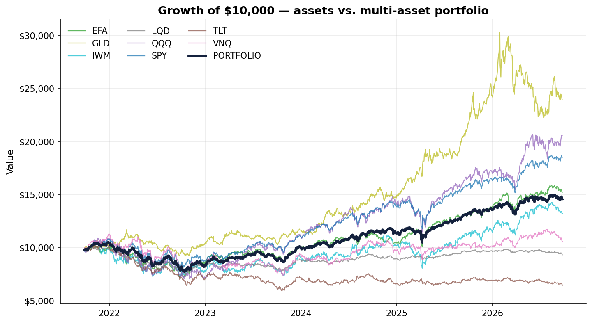

## Pipeline

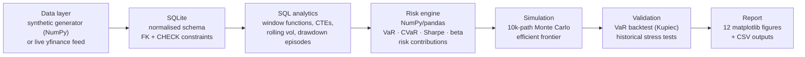

The pipeline is data-source agnostic: it ships with a reproducible synthetic dataset (so it runs anywhere, instantly) and switches to **live market data** with one flag:

```bash
python run_analysis.py            # bundled demo dataset (seeded, reproducible)
python run_analysis.py --live     # real 5y adjusted closes via yfinance (+ history back to 2007 for stress tests)
```

## Skills demonstrated

| Area | Where | What |
|---|---|---|
| **SQL** | [`sql/`](sql/) | Window functions (`LAG`, running `MAX`, explicit `ROWS BETWEEN` frames), CTE pipelines, `RANK`/`ROW_NUMBER`, gaps-and-islands episode grouping, `FIRST_VALUE`/`LAST_VALUE`, multi-table joins, schema design with FK + CHECK constraints |
| **Python / NumPy** | [`src/portfolio_risk/`](src/portfolio_risk/) | Vectorised simulation (Cholesky-correlated returns, regime-switching Markov chain), closed-form matrix optimisation, exact long-only max-Sharpe by subset enumeration, dataclasses, type hints |
| **pandas** | [`metrics.py`](src/portfolio_risk/metrics.py) | Time-series transforms, rolling statistics, pivot/long-format reshaping, groupwise analytics |
| **Statistics** | [`metrics.py`](src/portfolio_risk/metrics.py), [`monte_carlo.py`](src/portfolio_risk/monte_carlo.py) | Historical vs parametric vs simulated VaR (normal, Student-t, block bootstrap), expected shortfall, Euler and CVaR risk contributions, Sharpe/Sortino/Calmar, CAPM beta, drawdown analysis |
| **Risk validation** | [`backtest.py`](src/portfolio_risk/backtest.py), [`stress.py`](src/portfolio_risk/stress.py) | Out-of-sample VaR backtest with Kupiec's test, historical stress scenarios (2008, COVID, 2022) |
| **Data quality** | [`data_quality.py`](src/portfolio_risk/data_quality.py), [`data_quality.sql`](sql/data_quality.sql) | Checks on load: duplicates and bad closes stop the run; missing closes (SQL anti-join, cross-checked in pandas), 25%+ one-day moves and stale prices are flagged |
| **Testing** | [`tests/`](tests/) | 63 pytest cases; every SQL query is cross-validated against an independent pandas implementation |
| **Engineering** | [`.github/workflows/ci.yml`](.github/workflows/ci.yml) | CI on Python 3.10/3.12, packaging via `pyproject.toml`, one-command reproducibility |

## Key results: real market data

Yahoo Finance dividend-adjusted closes, 27 Sep 2021 – 24 Sep 2026 (1,252 trading days), pulled 25 Sep 2026. Reproduce with `python run_analysis.py --live`; outputs land in [`reports/live/`](reports/live/). The data-quality check flags one gap in the feed: no close for EFA, LQD and VNQ on 22 Sep 2026, so that date is dropped for every asset before returns are computed ([`reports/live/data_quality.csv`](reports/live/data_quality.csv)).

| Metric | Portfolio |
|---|---|
| Annualised return | **7.9%** |
| Annualised volatility | **13.0%** (vs 17.5% weighted average of holdings: diversification saves ~4.5 pts) |
| Sharpe / Sortino | **0.50 / 0.72** |
| Max drawdown | **−26.3%** (trough 14 Oct 2022, in the rate-hike sell-off when stocks and bonds fell together; back to the old peak on 27 Mar 2024) |
| Daily VaR / CVaR (95%) | **1.28% / 1.82%** |
| Daily VaR (99%): historical vs parametric | **2.08% vs 1.87%** |
| 1-year Monte Carlo VaR (95%, $100k) | **$12,713** |
| P(loss) over 1 year | **28.0%** |

**Fat tails, measured.** Historical and parametric VaR agree at 95% (1.28% vs 1.31%) but split at 99% (2.08% vs 1.87%). The portfolio's daily returns have an excess kurtosis of 6, a tail the normal curve doesn't see, which is why the project reports VaR more than one way.

**Where the risk comes from.** Each asset's share of portfolio volatility (Euler split) and of the loss on the worst 5% of days (CVaR split); both add up to 100%:

| Asset | Weight | Share of volatility | Share of tail loss |
|---|---|---|---|
| SPY | 25% | **31%** | **31%** |
| QQQ | 15% | **23%** | **23%** |
| VNQ | 10% | 11% | 12% |
| EFA | 10% | 11% | 10% |
| IWM | 5% | 7% | 7% |
| TLT | 15% | 7% | 7% |
| GLD | 10% | 5% | 6% |
| LQD | 10% | 4% | 4% |

Stocks are 55% of the money but about 72% of the risk. The bond and gold sleeves (35% of the weight) carry about 17%, and TLT still adds a little risk rather than offsetting it.

**Worst drawdown episodes.** Each fall counted once, from peak to trough to recovery:

| Peak | Low | Fall | Back to peak |
|---|---|---|---|
| 27 Dec 2021 | 14 Oct 2022 | **−26.3%** | 27 Mar 2024 (565 trading days) |
| 18 Feb 2025 | 8 Apr 2025 | **−11.7%** | 16 May 2025 (62 trading days) |
| 25 Feb 2026 | 27 Mar 2026 | **−7.8%** | 17 Apr 2026 (36 trading days) |

**Max-Sharpe portfolio (long-only, exact):** GLD 58%, SPY 42%, Sharpe 1.08 (the best of 20,000 random portfolios reached 1.04). That is what the last five years rewarded, not a recommendation: gold returned 19% a year over the window, and Markowitz puts the most money wherever history looked best.

Full per-asset table: [`reports/live/summary_metrics.csv`](reports/live/summary_metrics.csv) · SQL query outputs: [`reports/live/sql/`](reports/live/sql/)

### Do fat tails change the 1-year VaR?

The Monte Carlo draws normal shocks by default. Two fat-tailed alternatives test that assumption: Student-t shocks (degrees of freedom fitted to the portfolio's kurtosis, 5.0) and a block bootstrap that resamples real 21-day stretches of history.

| Shock model | 1-year VaR (95%, $100k) | 1-year CVaR (95%) | P(loss) |
|---|---|---|---|
| Normal | $12,713 | $17,309 | 28.0% |
| Student-t | $12,600 | $17,151 | 27.7% |
| Block bootstrap | $12,584 | $17,529 | 27.0% |

Barely any difference. The daily returns are fat-tailed, but over 252 days most of that averages out, so at a one-year horizon the normal model holds up. Fat tails matter far more over days than over a year, which is what the daily VaR comparison and the backtest are for.

### Does the VaR hold up? Backtest

Each day's VaR is forecast from the previous 250 days only, then compared with what actually happened (1,002 test days). Kupiec's test checks whether the number of breaches is plausible.

| Model | Breaches | Expected | Kupiec p-value | Result |
|---|---|---|---|---|
| Historical 95% | 46 | 50.1 | 0.55 | pass |
| Historical 99% | 10 | 10.0 | 0.99 | pass |
| Parametric 95% | 44 | 50.1 | 0.37 | pass |
| Parametric 99% | 13 | 10.0 | 0.37 | pass |

Both models pass. The normal-curve model misses more often at 99% (13 vs 10), in the direction the fat tails suggest, but not by enough to be significant over four years. The misses also bunch up: four of them came within a few days of each other in April 2025.

### Stress scenarios

Today's weights replayed through past crises, S&P 500 peak to trough, held with no rebalancing:

| Crisis | Window | Portfolio |
|---|---|---|
| 2008 financial crisis | 9 Oct 2007 – 9 Mar 2009 | **−31.9%** |
| COVID crash | 19 Feb – 23 Mar 2020 | **−21.5%** |
| 2022 rate shock | 3 Jan – 12 Oct 2022 | **−25.8%** |

2022 was nearly as bad as 2008 for this portfolio even though stocks fell about half as far. In 2008 long Treasuries (+25%) and gold (+24%) offset part of the loss; in 2022 Treasuries fell 29% alongside stocks. Details: [`reports/live/stress_scenarios.csv`](reports/live/stress_scenarios.csv)

### Demo dataset (synthetic, reproducible)

The default run uses a seeded synthetic dataset, so the pipeline runs anywhere, offline, with identical output. This is what CI tests.

| Metric | Portfolio |
|---|---|
| Annualised return | **10.6%** |
| Annualised volatility | **12.8%** (vs 18.7% weighted-average of holdings — diversification saves ~6 pts) |
| Sharpe / Sortino | **0.69 / 1.07** |
| Max drawdown | **−20.7%** |
| Daily VaR / CVaR (95%) | **1.16% / 1.53%** |
| 1-year Monte Carlo VaR (95%, $100k) | **$10,351** |
| P(loss) over 1 year | **21.7%** |

Full per-asset table: [`reports/summary_metrics.csv`](reports/summary_metrics.csv) · SQL query outputs: [`reports/sql/`](reports/sql/)

## The SQL layer

All analytical SQL lives in [`sql/`](sql/) as standalone, documented queries executed from Python. Example — 21-day rolling volatility with a Bessel-corrected standard deviation derived from first principles (SQLite has no `STDDEV`):

```sql
WITH returns AS (
    SELECT date, ticker,
           close / LAG(close) OVER (PARTITION BY ticker ORDER BY date) - 1 AS r
    FROM prices
),
rolling AS (
    SELECT date, ticker,
           AVG(r)     OVER w AS mean_r,
           AVG(r * r) OVER w AS mean_r2,
           COUNT(r)   OVER w AS n_obs
    FROM returns
    WHERE r IS NOT NULL
    WINDOW w AS (PARTITION BY ticker ORDER BY date
                 ROWS BETWEEN 20 PRECEDING AND CURRENT ROW)
)
SELECT date, ticker,
       SQRT(MAX(mean_r2 - mean_r * mean_r, 0.0) * n_obs / (n_obs - 1)) * SQRT(252.0)
           AS ann_volatility_21d
FROM rolling
WHERE n_obs = 21;
```

[`drawdown_events.sql`](sql/drawdown_events.sql) is the other one worth a look: it groups days into drawdown episodes (a gaps-and-islands problem, where a running count of new highs becomes the episode ID) and finds each one's peak, trough and recovery.

Every query is unit-tested against an independent pandas implementation of the same statistic ([`tests/test_database.py`](tests/test_database.py)), so the SQL is provably correct, not just plausible.

## Gallery

Charts from the real-data run. The demo run produces the same set in [`reports/figures/`](reports/figures/), except the stress chart, which needs real history.

| | |
|---|---|
| 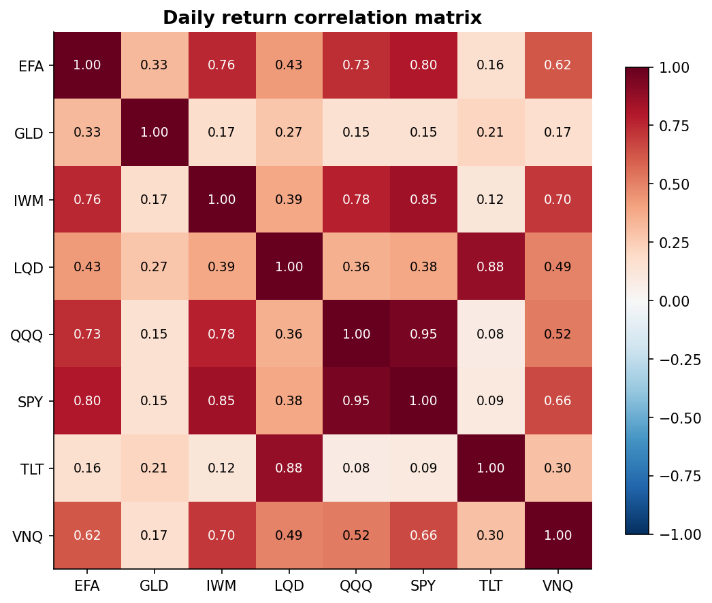 | 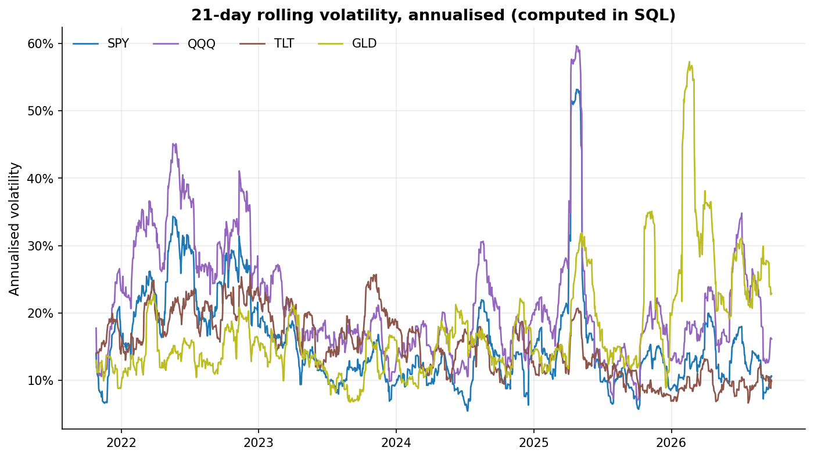 |
| 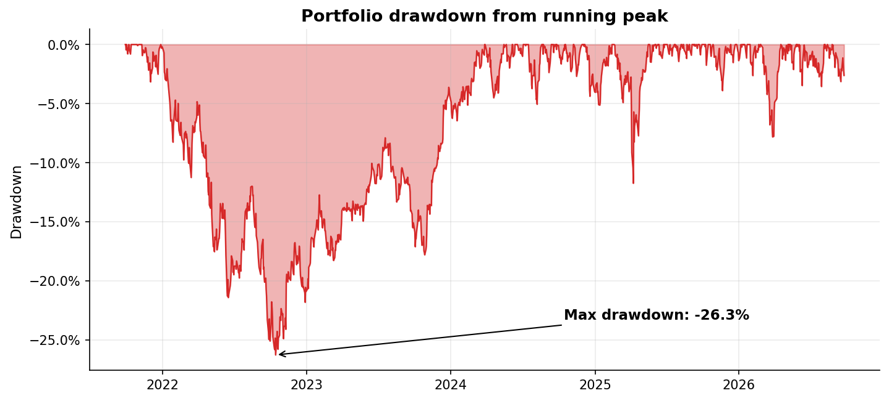 | 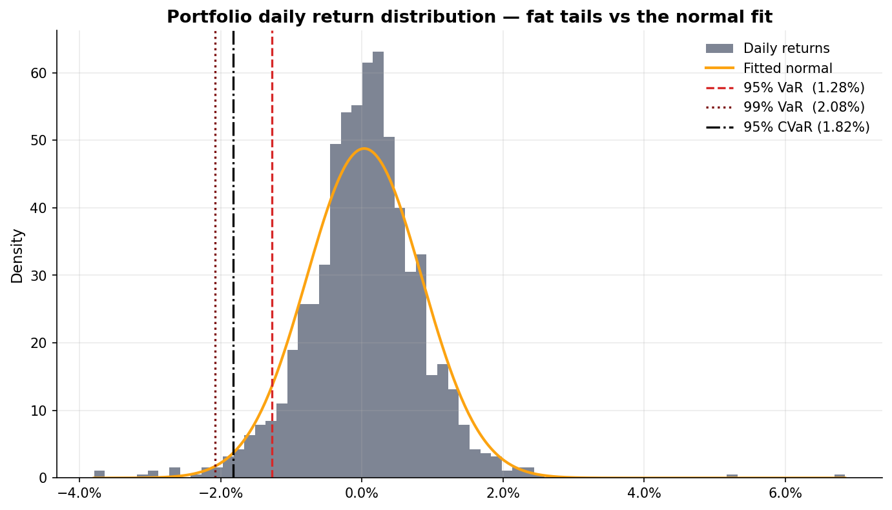 |
| 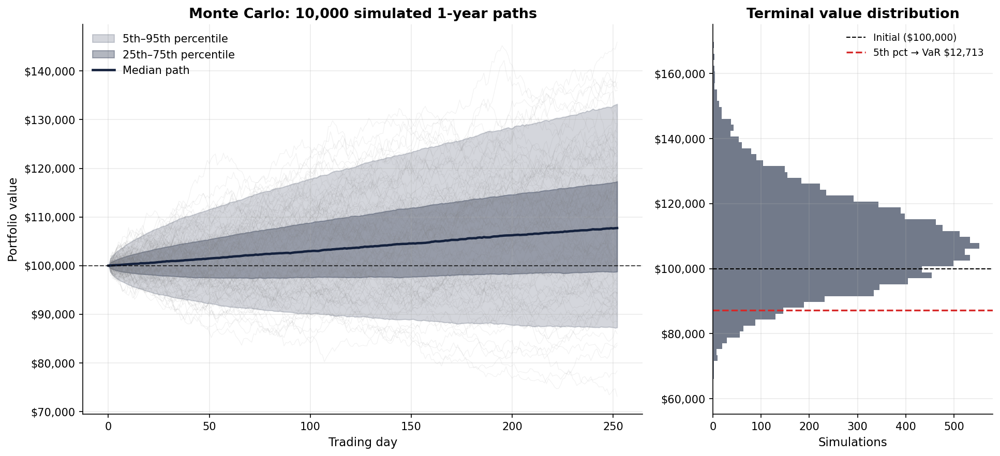 | 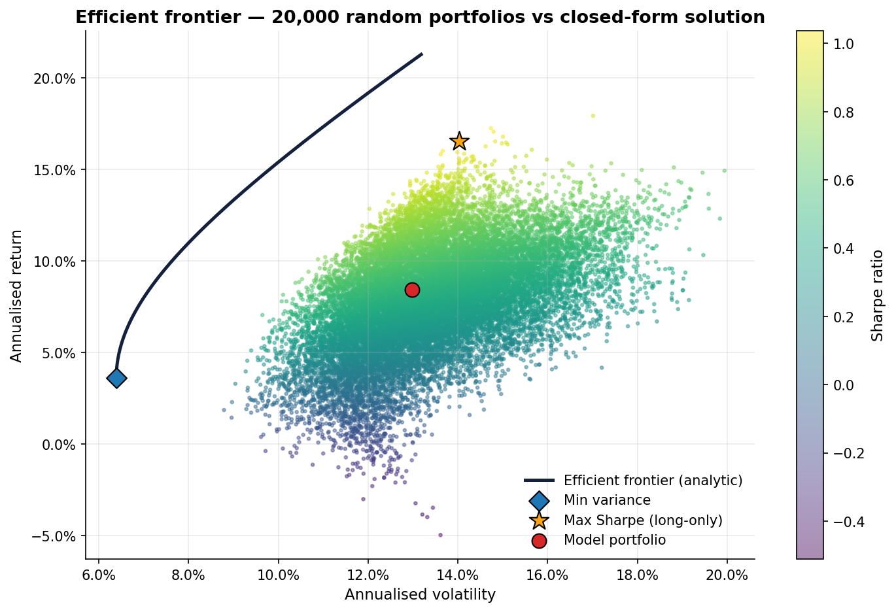 |
| 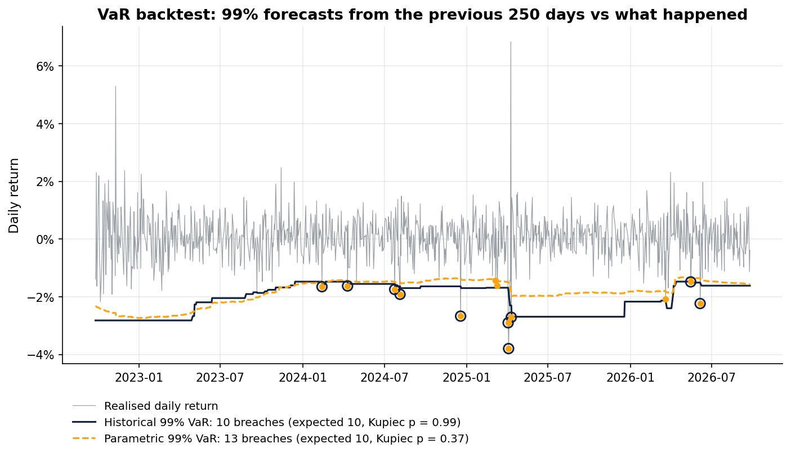 | 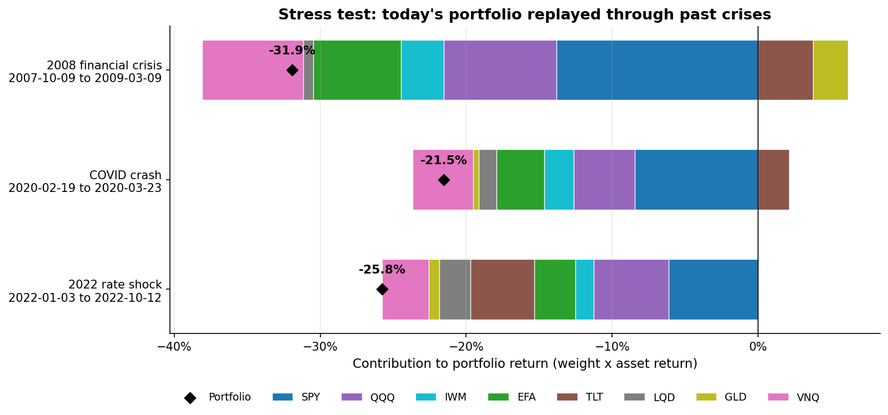 |
| 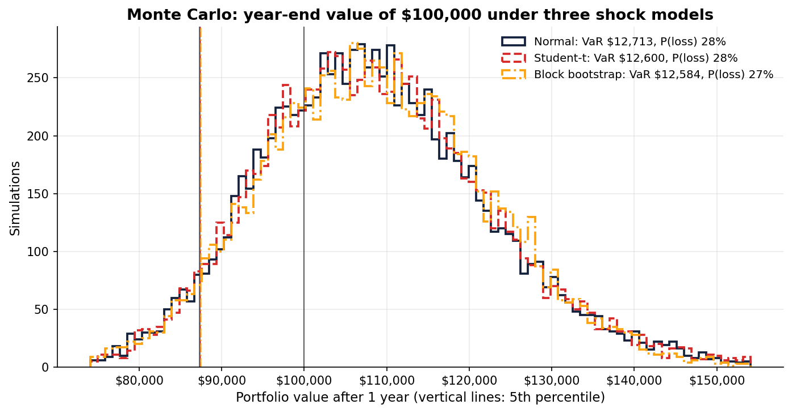 | 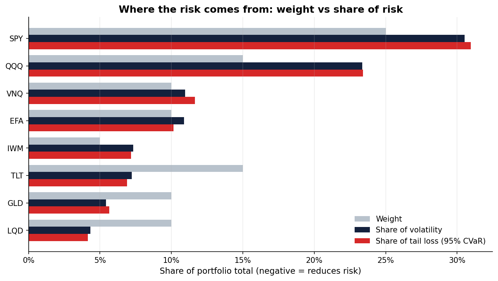 |

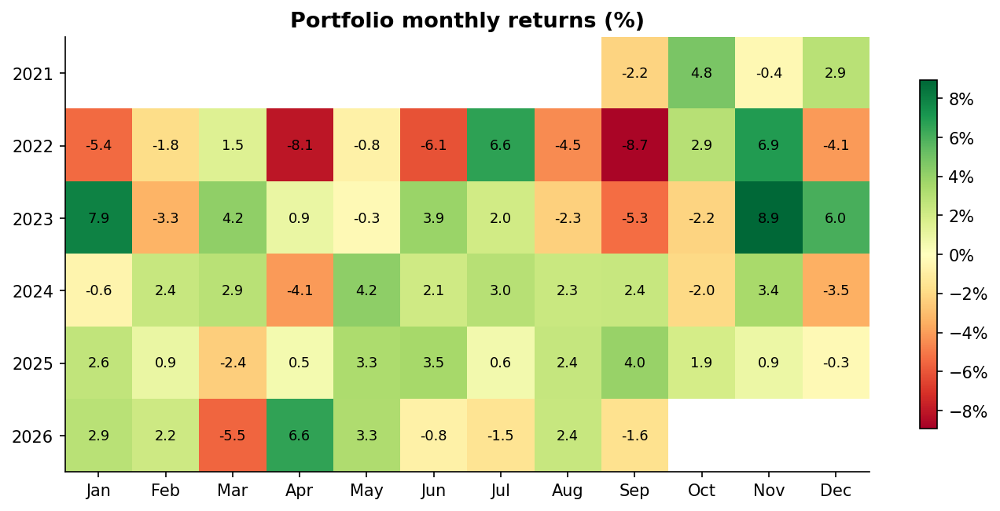

## Quickstart

```bash
git clone https://github.com/amanmir100-source/portfolio-risk-analytics.git
cd portfolio-risk-analytics
pip install -r requirements.txt

python run_analysis.py           # full pipeline: DB -> SQL -> metrics -> charts (~10s)
pytest                           # 63 tests
```

Or walk through the analysis narrative in [`notebooks/portfolio_risk_walkthrough.ipynb`](notebooks/portfolio_risk_walkthrough.ipynb).

## Project structure

```
├── run_analysis.py              # CLI entry point (demo / --live / --regenerate)
├── sql/                         # schema + 6 queries: analytics + a data-quality check
├── src/portfolio_risk/
│   ├── config.py                # asset universe, weights, regime parameters
│   ├── data_generator.py        # regime-switching correlated GBM (NumPy)
│   ├── live_data.py             # optional yfinance loader (same schema)
│   ├── database.py              # SQLite loading + query runner
│   ├── data_quality.py          # checks on load: duplicates, gaps, bad ticks, stale prices
│   ├── metrics.py               # Sharpe, Sortino, VaR/CVaR, beta, drawdowns
│   ├── monte_carlo.py           # 10k-path simulation: normal, Student-t, bootstrap
│   ├── optimization.py          # closed-form frontier + exact long-only max-Sharpe
│   ├── risk_contribution.py     # which assets drive volatility and tail loss
│   ├── backtest.py              # rolling VaR backtest + Kupiec test
│   ├── stress.py                # historical crisis replay
│   └── visualization.py         # 12 report figures
├── notebooks/                   # executed walkthrough notebook
├── tests/                       # 63 pytest cases incl. SQL <-> pandas cross-checks
├── data/                        # demo dataset (CSV); portfolio.db is rebuilt on run
└── reports/                     # figures + CSV outputs (live/ = real-data run)
```

## Methodology notes

**Three VaR estimates, on purpose.** Historical VaR reads the empirical quantile (assumption-free, but backward-looking); parametric VaR fits a normal distribution (fast, but understates fat tails); Monte Carlo VaR simulates the full 1-year horizon with correlated shocks (forward-looking; normal shocks by default, with Student-t and block-bootstrap versions to check that assumption). Comparing them is the point — the gaps between them are information.

**Synthetic data is generated honestly.** A two-state Markov chain switches the market between calm and stress regimes; in stress, volatilities scale up, risk-asset correlations tighten toward 1, and treasuries rally — the flight-to-quality pattern real portfolios live with. Shocks are correlated via Cholesky factorisation of regime-specific correlation matrices. The volatility-clustering visible in the rolling-vol chart is emergent from this design, not painted on.

**Backtests don't peek.** Every VaR forecast uses only the 250 days before the day it is judged on (a test enforces this). Kupiec's statistic is chi-squared with one degree of freedom, so its p-value comes from `math.erfc`; still no SciPy.

**Frontier is closed-form.** The minimum-variance frontier comes from the classic matrix algebra (A = 1ᵀΣ⁻¹1, B = 1ᵀΣ⁻¹μ, C = μᵀΣ⁻¹μ), validated against a 20,000-portfolio Dirichlet-sampled long-only cloud. The long-only max-Sharpe point is solved exactly: on any set of assets the best portfolio is the tangency portfolio Σ⁻¹(μ − r<sub>f</sub>), so the optimum is the best of the 255 asset subsets whose tangency weights are all positive. No SciPy; for hundreds of assets you'd switch to a QP solver.

## Disclaimer

The headline results and gallery use real Yahoo Finance data. The bundled dataset is **synthetic demo data** produced by the seeded generator in this repo; there, ticker symbols are used for realism only and the series are not real market history. This project is for educational/portfolio purposes and is not investment advice.

## License

MIT © 2026 Aman Mir
